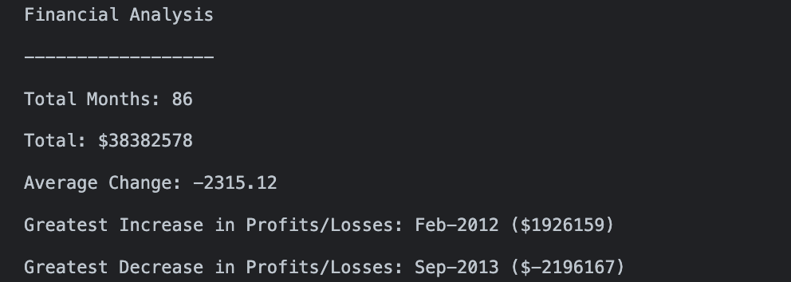

# Console Finances

Using pure Javascript to parse through a dataset and analyse the following:
1. The total number of months included in the dataset.
2. The net total amount of Profit/Losses over the entire period.
3. The average of the changes in Profit/Losses over the entire period.
4. The greatest increase in profits (date and amount) over the entire period.
5. The greatest decrease in losses (date and amount) over the entire period.

Then finally console.log the results.

## Application Appearance

View results [here](https://leannecodes.github.io/console-finances/).

## Usage

To view the report, please follow the following steps:
1. Right click on the webpage and select inspect
2. Navigate to the tab that's labelled "Console"
3. Scroll to the bottom to view final compiled report

## Notes
I have included my console.logs throughout the code, to show my workings and to make sure I was on track to find the correct data.

## Credit

- MDN Web Docs for the function to calculate the change in profit month-on-month.